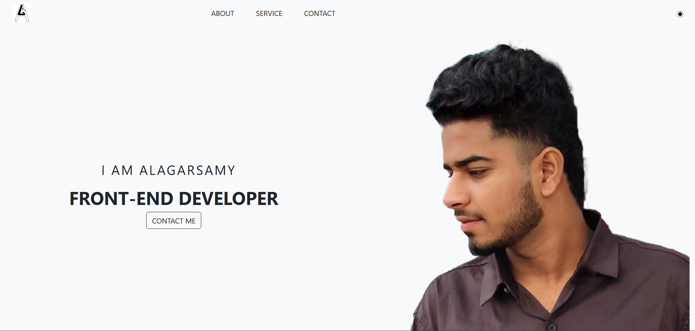

 #my portfolio
  
This is a responsive portfolio built with **React.js** and **Bootstrap**. The website showcases the my services and works.

  
   <h1>Preview</h1>   
   
   

[Live](https://alagar-portfolio.netlify.app/) 

     
   

- [@vitejs/plugin-react](https://github.com/vitejs/vite-plugin-react/blob/main/packages/plugin-react/README.md) uses [Babel](https://babeljs.io/) for Fast Refresh
- [@vitejs/plugin-react-swc](https://github.com/vitejs/vite-plugin-react-swc) uses [SWC](https://swc.rs/) for Fast Refresh
